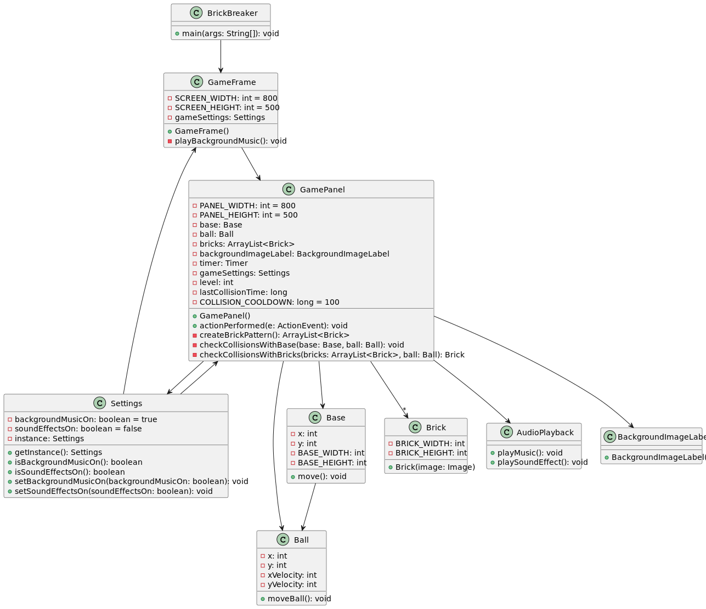
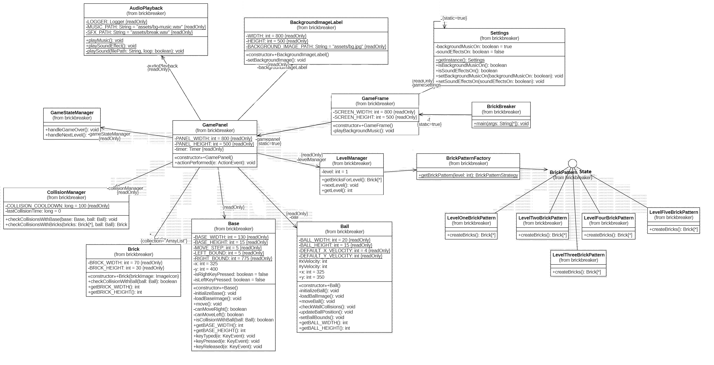

# 🎮 Brick Breaker Refactored

This repository contains a refactored version of the classic **Brick Breaker game**, developed as part of an assignment for the *Software Re-Engineering* course at FAST-NU Lahore.

---

## 👤 Author

- **Name:** Noor Fatima   
- **University:** FAST-NU, Lahore

---

## 📌 Project Objective

To re-engineer the Brick Breaker game by:

- Improving code maintainability
- Applying object-oriented design principles
- Introducing design patterns for better extensibility
- Refactoring legacy components into modular classes

---

## 🔨 Refactorings Applied

| Class                  | Refactorings Applied                                                                 |
|------------------------|--------------------------------------------------------------------------------------|
| `Brick`                | Moved `isCollisionWithBall()` from `GamePanel`                                      |
| `Ball`                 | Extracted methods: `loadBallImage()`, `moveBall()`, `checkWallCollisions()`, `updateBallPosition()` |
| `BackgroundImageLabel`| Introduced constants `WIDTH`, `HEIGHT`; extracted `setBackgroundImage()`             |
| `GamePanel`            | Replaced level variable with `LevelManager` (state), added `GameStateManager`, `CollisionManager`, and `BrickPatternFactory`; used Strategy Pattern for level behavior |
| `Base`                 | Extracted `canMoveLeft()`, `canMoveRight()` from `move()`, separated `loadBaseImage()` from constructor |
| `AudioPlayback`        | Extracted reusable method `playSound()`                                             |
| Other Classes          | General cleanup and separation of concerns                                          |

---

## 🧠 Design Patterns Used

- **Strategy Pattern**:  
  Separate classes for each level (`LevelOneBrickPattern`, `LevelTwoBrickPattern`, etc.), implementing a shared strategy interface.

- **Factory Pattern**:  
  `BrickPatternFactory` creates appropriate brick patterns based on the level number.

---

## 📁 Folder Structure

```
.
├── src/
│   └── brickbreaker/          # Java source files
├── test/
│   └── brickbreaker/          # JUnit test cases
├── test-reports/              # Generated test result HTML reports
├── lib/                       # External libraries (JUnit, Hamcrest, etc.)
├── metrics/                   # CKJM output and analysis
├── nbproject/                 # NetBeans project configuration
├── classDiagram.puml         # Original UML diagrams
├── classDiagram.svg          # Refactored class diagram
└── README.md                  # Project documentation
```

---

## 🧪 Testing & Reports

- Unit tests written with **JUnit 4.13.2**
- Test results in `/test-reports`
- Metrics generated with `ckjm_ext.jar` for software quality analysis

---

## 📦 Requirements

- Java 8 or later
- JUnit 4.13.2
- NetBeans (optional, for project configuration)
- ckjm_ext for class-level metrics

---

## 📷 Screenshots & Diagrams

### Original Diagram


### Refactored Diagram

---

## 🚀 Getting Started

1. Clone this repo:
   ```bash
   git clone https://github.com/noorophobia/Bricks.git
   cd Bricks
   ```

2. Compile & run using your IDE or command-line tools.

3. Run tests:
   ```bash
   javac -cp .;lib/* test/brickbreaker/*.java
   java -cp .;lib/* org.junit.runner.JUnitCore brickbreaker.AllTests
   ```

---

## 📬 Contact

For questions or suggestions, feel free to reach out to **Noor Fatima**  
✉️ [youremail@example.com] *(Replace with your real email)*

---
